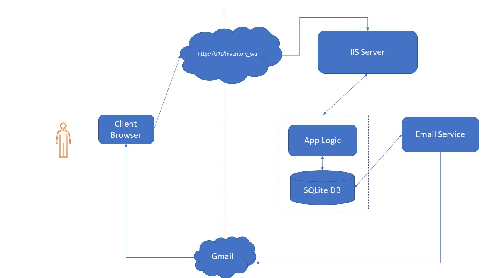
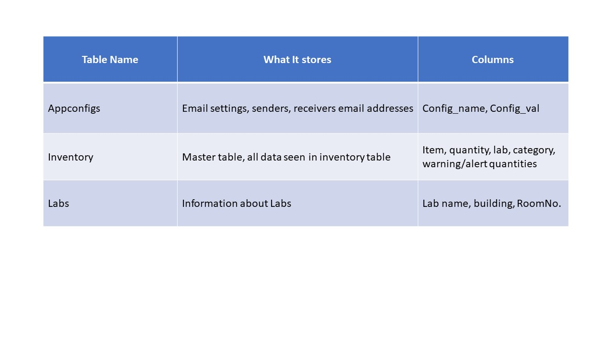

   

-----------------

# Table of Contents
- [What is it](#what_is_it)
- [Main Features](#main-features)  
- [Project Structure](#project_structure)
- [How to Run ETS_Inventory_WA](#how-to-run)
- [Architure Diagrams](#digs)   
- [Discussion and Development](#dev)
- [Contribution](#contri)

# ETS-Inventory (v0.0.1) : A tool to manage simple inventory tracking and notification

# What is it? 

This repository is a host for the code I write as part of an Inventory tool built for the [Engineering Technology Services](https://www.engr.colostate.edu/ets/) at CSU. 
It consists of a thin client-server tool accessible via hosting it on an IIS server. I use a simple SQLite Database file to store and retrieve records.
I've set up the IIS , .NET Framework and libraries required to host and run applications on a machine in the Engineering Department(win-compute-12).
This version of the tool (v0.0.1) has 2 different pages: One for Labs, and One for Inventory.

# Main Features 

- View/Insert/Update your inventory stock, all in one Single Page Application. 
- Filter by Lab, Category and even item name!
- Specify how much of each item is a "warning-low" and how much is "alert-low". ( this is useful later. )
- Search and update records feature neatly tucked away in a cool sidebar.(Hint, check the Hamburger on the top-right) 
- Clear color-coded Red/Orange highlights for alert/warning quantity items in stock.
- Inbuilt functionality to send low-stock alert emails to your inbox on click or at a fixed time every day.(Provided the app is running).
- Working on an email service to do the above feature without needing the app to be run. (background C# windows service)
- Database Schema built to handle several configurable extensions to the code via the appconfigs table.

# Project Structure 
    /DatabaseInterface      # Class to interact and query the SQLite DB 
    /Pages        # where Inventory and Lab ASPX Pages and CS codebehind for the client are stored
    /Properites   # where VS2017 stores assembly information
    /Temp         # backups and experiments with Master Page features for the app. 
    /dependencies # jQuery and Bulma CSS dependencies 
    /bin          # contains the dlls and compiled files for the debug/release versions of the app.
    /backup-db    # name says it all
    sample_inventory.db   # the SQLite DB being accessed by the app.
    log4net.config   # config file for the logging library being used by the app
    Web.config    # Main Config file for the solution
    properties.xml # place to store extensible config values(other than the DB)
        

# Where to use it 
Work in Progress

# How to run - in Development Mode 
If you want to make changes, tweak or fix something, this is how to get the code set up for development on your PC. 
1. Clone the repository
2. Navigate to the Inventory_WebApp directory
3. Open the solution in Visual Studio 2017+
4. Run a clean-build of the app in `Debug` mode. (regular build is okay, but good practice)
6. Press `F5`,a local webserver will be started by VS running it on your machine.

# How to Deploy ( 2 ways ) 
If you just want to use it, you will want to deploy this app on a windows/IIS server. The code on this repo is a development copy of the source, so you would either need to download and compile this code with visual studio, or take the latest stable version running on win-compute-12. (a self-contained directory that can run on your server that can be copied and pasted and run after changing a few permissions)
## 1. with Visual Studio
  1. Run a clean-build of the code in `Release` mode
  2. Go to `Build -> Publish` and select the default settings to deploy to localhost. 
  3. If the publish works fine, This should set the app working on   
  4. Run a clean-build of the app in `Debug` mode. (regular build is okay, but good practice)
6. The sample webserver will be started by VS running it on your local system.
## 2. using the latest stable version on win-compute-12
  1. log into `win-compute-12`
  2. go to `C:\\inetpub\wwwroot\`
  3. zip the entire `Inventory_WebApp` directory. 
  4. copy and unzip the directory to your own server/machine, any path should be fine, but if you're not sure, use `C:\\inetpub\wwwroot\`
     1. give the whole Inventory_WebApp write permissions for the IIS Users group, (the name of the group should be something similar to IUSR or IIS User)
     2. give the inventory_database_exceptions.log and sample_inventory.db files write permissions for IUSR groups/other IIS user groups  
  5. make sure IIS server is installed and configured to run .NET 4.7. Leaving a few links to guide you: [link1](https://www.systemsitpro.com/2017/02/how-to-install-iis-10-on-windows-server_3.html) [link2](https://enterprise.arcgis.com/en/web-adaptor/latest/install/iis/enable-iis-2016-components-server.htm)
  6. you may be able to see your folder under `Sites/Default Web Site/` in the *left sidebar* on the IIS main screen
  7. right-click the folder and select 'convert to web-application'. the icon for the folder should change to a globe(something similar)
  8. click on the folder and select 'Explore' on the right sidebar on the IIS screen.

# Architecture Diagrams 

   

   

# Discussion and Development 
All development and discussion was done with Nick Stratton, Jeff Penn and the Engineering Technology Services team at the Dept of Engineering. This Project was developed as an proposed proposed internal tool to aid in the management of inventory at the various [labs](https://www.engr.colostate.edu/ets/lab-and-classroom-overview/) in the Engineering Department.

# Contributing to ETS-Inventory 
All contributions, bug reports, bug fixes, documentation improvements, enhancements, and ideas are welcome.

#### Created by [Sanket Mehrotra](https://github.com/mehrotrasan16)

